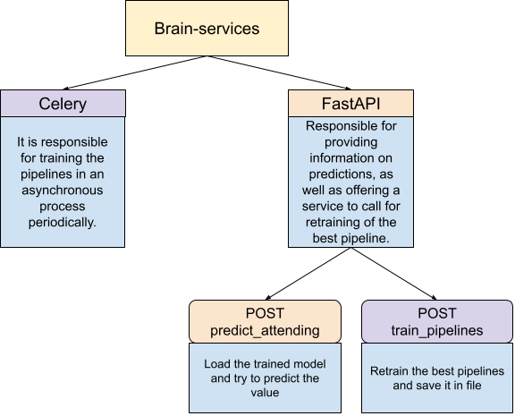
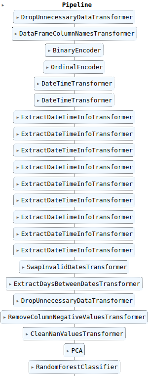

# Brain-services

This repo is the main brain for the Senniors test.

The previous exploration of the data was made in the
[Senniors-data-explorer repo](https://github.com/martingaldeca/Senniors-data-explorer),
where you can check some visualizations of the provided data.

## Assumptions from exploration

From the exploration we may make some assumptions in order to clean and to train our models.

* Value of age can not be lower than 0, if it is the case it will be swapper to 0
* Dates of appointment and scheduled can be swapped if it has not sensed, time travelling for customers not allowed (yet :D)
* Due to the small amount of data we will suppose that months are not relevant
* Due to the small amount of data we will suppose we do not know all the possible neighbours
* All Nan data will be dropped
* We suppose only 2 possible genders

Due to the small amount of data we do not want to fix from the beginning of the project the relevant variables, so we
will use PCA optimizations with different values of relevant components (the number can be updated in the settings of
celery_brain_services module).

Also, the model for the classificator will not be fixed from the beginning of the project, so we will train different
models and check each time which one has better results.

The models to use are the following:

* DecisionTreeClassifier
* GaussianNB
* KNeighborsClassifier
* RandomForestClassifier

The pipeline with the best result will be stored in the `TRAINED_FILE_PATH` path (you can update this value in .env
file)

## Requirements

The following requirements are needed:

* docker
* docker-compose

But in order to perform debug tasks and also to simplify the work is highly recommended to have also these dependencies:

* python >=3.9
* make
* pipenv
* poetry

## Installation

If you have the minimum requirements, run the project is a piece of cake, just run the following:

```shell
docker-compose up -d
```

And if you have make, is even easier:

```shell
make
```

And voila!, your project will be running in a docker container


## How it works?

All the project is dockerized, and it has not extra requirements, so it can be deployed easily anywhere.

The main architecture of the service is as following:



The pipeline to use is not just one. The main process to train pipelines is
in `src/celery_brain_services/tasks/train_and_select_pipelines.py`

It will use different models and different PCA optimizations, and check which has the best predictions on the test data,
so, maybe when the data grow up, the best pipeline can change.

In order to optimize resources if a model with fewer components has the same scoring rounded to the second decimal, it
will be the "winner".

All the pipelines must pass through a data clean transformations. You can check all these transformers in the
module `brain_services.transformers`



## Tests

The project only has unit tests, and to check that all tests are ok just exec the following:

```shell
make test
```

or

```shell
docker exec senniors_brain_services python -m pytest --log-cli-level=ERROR --disable-pytest-warnings
```

## Next steps

* First we should create a CI/CD, maybe with jenkins and a Jenkinsfile, that pass all the tests if needed and deploy the
  project in different environments.
* Then we need to create E2E test cases, maybe with postman and a newman container.
* Also, it must be integrated with the backend databases. Instead of using a csv it should extract the information from
  a database shared with the backend.
* Instead of saving the pipelines in local, it should be uploaded to an S3 instance.